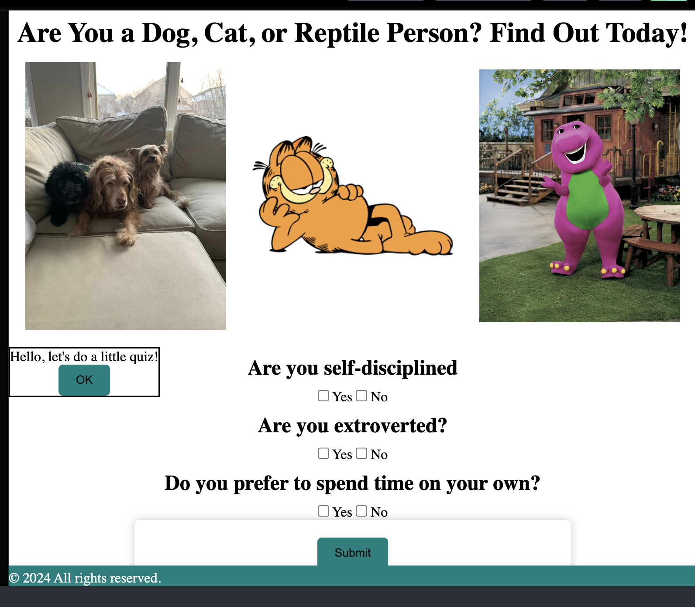

# Pet Preference? Based on Personality Traits 
Have you ever been frustrated when people ask if you're a dog or cat person, but provide no third option? In this project, we will be providing a quiz to tell you if you are a dog, cat, or reptile/rodent person. Take our number of questions quiz to learn today!

## Initial concept 

The idea of the pet preference was that all in our project group loves animals. We decided to do a project based on personality traits. We wanted to research quickly and create a quick quiz. 
We also wanted to test out if someone likes the outdoors, do they have a personality compatable to own a dog?
If a person is easily stressed out, do they have a personality compatable to own a cat?
If a person is a nature conservationist, do they have a personality compatable to own a reptile?

### User Story

Are you tired of the regular dog or cat quiz?
We have a third option. Reptile

#### Acceptance Criteria
It done when we have working html website that links to pictures of dogs, cats, or a surprise animal.

It done when we use the form to email the results. 

Link to Boot CSS Strap

Have a workable question and answers 
Inline-style:

##### Acknowledgements of all contributors to the project: 
Claree Ratliff
Sophia Schooler
Rachel Reyes

